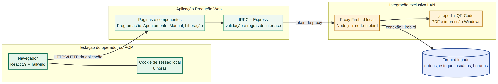
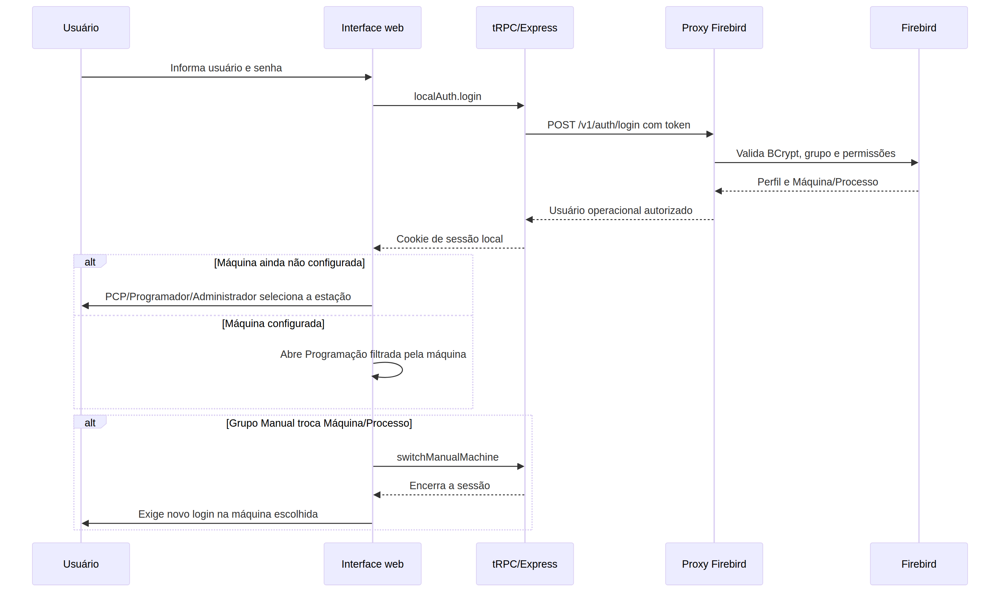
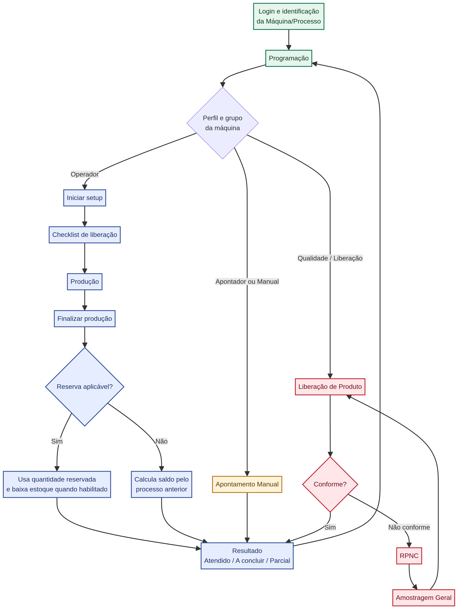

# Curso de Arquitetura e Manutenção — Produção Web / XPAPER

> **Objetivo deste curso:** permitir que uma pessoa técnica compreenda como o sistema foi construído, onde cada regra vive e como alterar o projeto sem quebrar os fluxos de produção já homologados. O sistema foi pensado para operar **somente na LAN**, preservando o Firebird legado como fonte de dados e regras industriais.

| Item | Situação documentada |
|---|---|
| Interface | React 19, TypeScript, Tailwind CSS 4 e componentes Radix/shadcn. |
| Servidor da aplicação | Express 4 com tRPC 11. |
| Banco operacional | Firebird acessado apenas pelo proxy Node.js com `node-firebird`. |
| Impressão | jsreport, QR Code e impressão Windows por `pdf-to-printer`. |
| Validação do código | Vitest, TypeScript, build Vite/esbuild e checagem de sintaxe do proxy. |
| Escopo | Programação, Apontamento, Manual, Liberação, RPNC, reservas, paletização, etiquetas e filas. |

---

## 1. Mapa geral: como pensar no projeto

O Produção Web não é um sistema novo isolado. Ele é uma camada web operacional que replica a experiência e as regras do Delphi legado, mas deixa o **Firebird no servidor local**. O navegador não recebe credenciais do banco nem cria conexão direta. Toda leitura ou gravação passa por regras intermediárias, o que reduz o risco de expor o banco na rede e concentra as regras industriais em um ponto controlado. [1] [2]



### O caminho de cada dado

| Etapa | Quem executa | O que acontece |
|---|---|---|
| 1. Interface | Navegador do operador, PCP ou Qualidade | Exibe a tela de Programação ou Apontamento e coleta ações do usuário. |
| 2. Regra web | React + tRPC/Express | Valida a intenção da tela, conserva a sessão e chama apenas procedimentos permitidos. |
| 3. Integração LAN | Proxy Firebird | Autentica a chamada por token, consulta ou grava no Firebird e aplica regras de máquina. |
| 4. Banco legado | Firebird | Mantém usuários, OPs, processos, reservas, horários, estoque e cadastros industriais. |
| 5. Saída física | Proxy local | Localiza impressoras instaladas, gera PDF e envia a etiqueta quando a operação solicita impressão. |

> **Regra de ouro:** o frontend mostra e conduz o fluxo; o proxy local decide o que pode ser lido ou gravado no Firebird. Não coloque SQL, senha do banco ou regra crítica exclusivamente no navegador.

---

## 2. A estrutura de pastas: onde cada parte foi codificada

A navegação principal começa em `client/src/App.tsx`. A rota raiz abre a Programação; as rotas de apontamento são separadas porque cada uma tem campos e regras próprias. [3]

```text
producao-web/
├── client/src/
│   ├── pages/
│   │   ├── Programming.tsx              # Tela principal: Programação por Máquina/Processo
│   │   ├── Pointing.tsx                 # Apontamento normal do Operador
│   │   ├── ManualPointing.tsx           # Apontamento Manual e Apontador
│   │   └── ProductReleasePointing.tsx   # Liberação de Produto / Qualidade
│   ├── components/                      # Modais, grids, primitivas e formulários reutilizáveis
│   ├── contexts/ThemeContext.tsx        # Tema e tipografia persistidos por computador
│   └── index.css                        # Tokens visuais globais dos temas Verde e XSTI
├── server/
│   ├── routers.ts                       # Ponto de entrada tRPC
│   ├── routers/localAuth.ts             # Login, estação e sessão Manual
│   ├── routers/production.ts            # Procedimentos da operação
│   ├── firebirdProxy.ts                 # Tipos e chamadas para o proxy LAN
│   └── localSession.ts                  # Cookie JWT local de oito horas
├── local-firebird-proxy/
│   └── server.mjs                       # Único processo que usa node-firebird e imprime no Windows
├── docs/                                # Manuais técnicos e este curso
└── server/*.test.ts                     # Regressões Vitest das regras industriais
```

| Se precisar alterar… | Comece por… | Depois confira… |
|---|---|---|
| Visual de tela, modal ou grid | `client/src/pages` e `client/src/components` | `client/src/index.css` e o teste de regressão relacionado. |
| Tema, fonte ou contraste | `ThemeContext.tsx`, `ThemeConfigurator.tsx` e `index.css` | Os dois temas: Verde e XSTI. |
| Login, perfil ou estação | `server/routers/localAuth.ts` e `server/localSession.ts` | `local-firebird-proxy/server.mjs`. |
| Consulta/gravação Firebird | `local-firebird-proxy/server.mjs` | Tipos em `server/firebirdProxy.ts` e a rota tRPC correspondente. |
| Regra operacional | Página React para a experiência e proxy para a decisão/gravação | Teste Vitest do fluxo antes de entregar. |
| Etiqueta e impressão | `server/processLabelPdf.ts` e `local-firebird-proxy/server.mjs` | Prévia PDF e impressora Windows do proxy. |

---

## 3. Aula 1 — Entrada, login e Máquina/Processo

O acesso parte do componente de proteção de tela. Quando não há sessão local, a aplicação exibe o login local; quando a autenticação é bem-sucedida, a mesma tela inicial abre a Programação. O cookie de sessão guarda os dados mínimos do usuário e da Máquina/Processo, com duração de oito horas. [4] [5]



### Como o perfil é decidido

O proxy consulta os usuários e grupos existentes no Firebird e transforma esse resultado em um perfil operacional. Os principais perfis usados pela interface são **operador**, **programador**, **manual-pointing** (Apontador), **manual-production** (Manual) e **quality-release** (Qualidade/Liberação). A máquina é procurada pelo vínculo da estação, prioritariamente por `MQP_LOGON`, com alternativas controladas no `.env`. [2] [6]

| Situação | Comportamento atual |
|---|---|
| Operador | Entra somente na Máquina/Processo operacional atribuída e usa a tela de Apontamento normal. |
| PCP, Programador ou Administrador | Pode configurar a Máquina/Processo quando a estação ainda não está definida. |
| Apontador | Opera somente na máquina Apontamento e abre o fluxo de Apontamento Manual. |
| Manual | Opera processos manuais e pode escolher outra Máquina/Processo **manual**, sem Liberação ou Apontamento. A troca encerra a sessão e exige novo login. |
| Qualidade | Opera somente as máquinas do grupo de Liberação de Produto. |

### Onde modificar com segurança

Se um novo grupo de usuários for criado no Firebird, não basta alterar o frontend. Primeiro ajuste o mapeamento do proxy e os filtros de autorização; depois confirme qual tela e quais ações esse grupo poderá acessar. Por fim, crie um teste de regressão que cubra uma combinação permitida e uma combinação bloqueada.

---

## 4. Aula 2 — Programação: a tela central

A raiz do sistema abre `Programming.tsx`. Essa tela concentra a fila da Máquina/Processo, filtros de Status e busca, processos superiores, dados técnicos, ajustes, ferramentas, atalhos e as consultas auxiliares. Ela não é apenas uma tabela: é o ponto de decisão que leva cada perfil ao apontamento correto. [3]

### Elementos importantes da Programação

| Elemento | Por que existe | Regra de manutenção |
|---|---|---|
| Grid de OPs | Mostra a fila e o status real do processo. | A ordenação por título é reutilizável e não deve ser removida. |
| Status | Limita a visão a Liberado, Parcial e Em Produção quando aplicável. | O filtro é enviado até o proxy; não filtrar apenas visualmente. |
| Processos superiores | Mostra máquinas/processos relacionados à OP. | Mantém as cores da Consulta de Fila. |
| Painel de ajustes | Mostra largura, comprimento, cores, clichês e facas. | Depende da OP selecionada, não da máquina que estava aberta originalmente. |
| Barra inferior | Reúne consultas operacionais, impressão e Fechar. | Deve permanecer no fim da tela para uso em chão de fábrica. |

Os cabeçalhos de grid foram centralizados para manter fonte reforçada, maior contraste e ícones de ordenação legíveis nos dois temas. A referência visual foi a tela de Reserva. A alteração fica em `index.css` e em `SortableHeader`, dentro de `ProductionPrimitives.tsx`.

---

## 5. Aula 3 — Apontamento do Operador

O fluxo de Operador combina cronômetro, setup, checklist, rastreabilidade, reserva e finalização. O desenho abaixo mostra os desvios mais importantes. O retorno após qualquer resultado termina novamente na Programação, para que a fila e os status sejam recarregados. [7]



### A lógica do saldo e da reserva

Quando existe reserva aplicável, o sistema mostra a **Quantidade reservada** e usa a regra de reserva para a finalização. Quando não existe reserva aplicável, ele apresenta a **Quantidade a apontar**, calculada pela produção do último processo anterior válido menos a produção já registrada no processo atual. Os dois painéis são mutuamente exclusivos para não induzir o operador a interpretar dois saldos diferentes. [1]

| Cenário | Informação apresentada | Consequência na finalização |
|---|---|---|
| Com reserva aplicável | Quantidade reservada | A baixa de reserva ocorre apenas com as chaves de escrita habilitadas. |
| Sem reserva aplicável | Processo anterior e Quantidade a apontar | O saldo é calculado a partir do processo anterior efetivamente apontado. |
| Produção cobre o saldo | Resultado Atendido obrigatório | Evita manter processo pendente sem justificativa. |
| Produção abaixo do saldo | Parcial ou A concluir | Mantém o processo aberto conforme a decisão operacional. |

Os botões de resultado são operacionais, não decorativos. Em todos os apontamentos eles permanecem **Atendido em verde**, **A concluir em laranja** e **Parcial em azul**, independentemente do tema. As descrições abaixo dos botões foram removidas para manter a leitura direta.

---

## 6. Aula 4 — Manual, Apontador e Liberação de Produto

Os processos manuais não são uma cópia simples do apontamento normal. O modo **Apontador** pode iniciar múltiplas OPs no grupo Apontamento e abre o formulário manual. O grupo **Manual** utiliza máquinas marcadas como processo manual e, quando necessário, registra quantidade de pessoas. O grupo **Qualidade** abre a Liberação de Produto, que calcula lote, amostra, N e NC e trata o ciclo de não conformidade. [1]

### Produção Especial

Em Produção Especial, uma OP principal representa o conjunto de OPs que serão apontadas juntas somente nos grupos de Apontamento, Manual e Liberação. No grid principal aparece a OP especial com a ação **Conjunto**; as componentes ficam ocultas do grid para não duplicar a programação. Em processos normais, cada OP continua sendo tratada individualmente.

### RPNC e Amostragem Geral

Quando a Qualidade registra uma RPNC, o processo segue para **Amostragem Geral**, conserva o status Liberado e encerra o horário ativo com quantidade zerada. Depois que a Qualidade aponta a amostragem, a Liberação é aberta novamente com os campos específicos dessa etapa. Esse fluxo foi mantido separado para evitar que uma não conformidade seja tratada como uma finalização comum.

---

## 7. Aula 5 — Firebird, proxy e escrita protegida

O `local-firebird-proxy/server.mjs` é a camada crítica do projeto. Ele abre o pool Firebird, resolve perfil e Máquina/Processo, expõe somente endpoints conhecidos e executa as transações operacionais. A aplicação web chama esse proxy por token; o browser não conhece a senha do Firebird. [1] [2]

### Variáveis importantes do `.env`

| Variável | Uso | Cuidado operacional |
|---|---|---|
| `FIREBIRD_PROXY_HOST`, `FIREBIRD_PROXY_PORT`, `FIREBIRD_PROXY_TOKEN` | Liga a aplicação web ao proxy. | Nunca publicar o token em repositório ou no navegador. |
| `FIREBIRD_HOST`, `FIREBIRD_DATABASE`, `FIREBIRD_USER`, `FIREBIRD_PASSWORD` | Liga o proxy ao banco. | Ficam somente no computador/servidor que roda o proxy. |
| `FIREBIRD_ENCODING` | Define a codificação do banco legado. | O padrão atual é WIN1252; mudar somente após validar a base. |
| `FIREBIRD_MACHINE_LOGON` | Força a identificação de uma estação. | Útil quando o hostname não corresponde ao cadastro. |
| `PRODUCTION_POINTING_WRITE_ENABLED=S` | Libera escrita de apontamento. | Use somente em teste ou operação controlada. |
| `PRODUCTION_STOCK_WRITE_ENABLED=S` | Libera baixa de reserva e estoque. | Exige também a chave de apontamento. |
| `PRODUCTION_PROCESS_INSPECTION_INTERVAL_MINUTES` | Define o intervalo da Inspeção de Processo. | Em teste pode ser `1`; em operação o padrão é 20. |

> **Nunca teste baixa de estoque ou finalização em uma OP real apenas para “ver se funciona”.** A escrita atualiza processo, reserva e estoque dentro de transação. Use uma OP de teste, registre os saldos e mantenha um procedimento de reversão aprovado. [1]

---

## 8. Aula 6 — Etiquetas, PDF e impressão Windows

As etiquetas não dependem da fonte configurada na interface web. Elas possuem modelos próprios porque o papel e a leitura por scanner exigem medidas estáveis. A Etiqueta de Processo e a Etiqueta de Produto Acabado são geradas em PDF por jsreport; a impressão direta é feita pelo proxy local, que enxerga as impressoras Windows da máquina em que ele está instalado. [1] [8]

| Tipo de etiqueta | Momento | Dados importantes |
|---|---|---|
| Etiqueta de Processo | Durante o apontamento | OP, processo atual/próximo, cliente, junta, resina, QR Code e logomarca. |
| Etiqueta de Produto Acabado | Finalização do grupo Apontamento | Produto, cliente, quantidade, OP, fabricação e QR Code por `PV_CODIGO`. |

Se uma etiqueta sair desconfigurada, primeiro confirme se a estação está usando o pacote atual, depois teste a prévia PDF e somente então analise a impressora. Não altere o CSS do frontend tentando corrigir um PDF: o modelo impresso é independente.

---

## 9. Aula 7 — Tema, tipografia e padrão visual

O sistema possui os temas **Verde Produção** e **XSTI**, persistidos por navegador. Cada tema pode guardar fonte, tamanho, negrito e itálico; o padrão atual é **Tahoma 15px em negrito**. Os tokens ficam em `index.css`, e o contexto aplica as variáveis CSS ao documento. A regra também sobrescreve classes de família de fonte que poderiam escapar do padrão global. [9]

| Regra visual | Decisão aplicada |
|---|---|
| Tipografia de interface | Configurável pelo Tema e aplicada a textos, campos, grids e modais. |
| Etiquetas PDF | Ficam com especificação própria e não acompanham o Tema. |
| Cabeçalhos de grid | Tamanho, peso, espaçamento e altura reforçados nos dois temas. |
| Resultado de produção | Cores fixas: verde, laranja e azul; não muda com o tema. |
| Fechar/Cancelar | Vermelho sólido para ação de saída ou cancelamento. |

Ao ajustar um visual, faça a alteração com tokens ou classes reutilizáveis. Evite corrigir uma tela com uma cor isolada quando o mesmo componente aparece em Programação, Fila, Manual e Liberação.

---

## 10. Aula 8 — Como criar uma melhoria sem regressão

O histórico do projeto mostrou que alterações locais podem afetar outros fluxos. A prática correta é partir da regra, localizar o componente reutilizado, criar ou ajustar um teste, validar o build e só então entregar o pacote completo.

### Roteiro recomendado de alteração

| Passo | Ação prática | Critério de conclusão |
|---|---|---|
| 1. Entender | Registrar em `todo.md` exatamente o pedido. | A intenção fica rastreável. |
| 2. Localizar | Pesquisar página, componente, router, proxy e testes ligados ao fluxo. | Não alterar por suposição. |
| 3. Implementar | Separar mudança visual, regra web e regra Firebird. | O frontend não vira fonte única de verdade. |
| 4. Testar | Executar `pnpm test`, `pnpm check`, `pnpm build` e `node --check local-firebird-proxy/server.mjs`. | Sem falha de teste, tipos, build ou sintaxe. |
| 5. Conferir | Quando houver tela acessível, revisar a experiência visual e os dois temas. | Texto, contraste e ações continuam legíveis. |
| 6. Empacotar | Criar checkpoint e gerar somente ZIP LAN completo. | `.env`, `data`, `node_modules`, `dist` e `.git` ficam fora do pacote. |

```bash
# Na raiz do projeto
pnpm test
pnpm check
pnpm build
node --check local-firebird-proxy/server.mjs
```

> O pacote completo evita que uma correção parcial substitua arquivos incompatíveis ou apague melhorias feitas em outras telas. Antes de extrair um pacote novo, preserve sempre `.env` e `data/` da instalação atual.

---

## 11. Aula 9 — Diagnóstico rápido por sintoma

| Sintoma | Primeiro local para investigar | Não fazer |
|---|---|---|
| Login não entra | `localAuth.ts`, proxy `/v1/auth/login`, vínculo de estação e grupo Firebird. | Alterar senha ou grupo por tentativa sem ler o retorno do proxy. |
| Máquina errada | `MQP_LOGON`, `FIREBIRD_MACHINE_LOGON`, persistência de estação. | Vincular operador a uma máquina fixa sem confirmar a regra de perfil. |
| Grid não filtra | Página de Programação, parâmetros tRPC e endpoint correspondente no proxy. | Filtrar somente no navegador e esconder registros que o backend ainda entrega. |
| Reserva incorreta | Tipo/grupo da reserva e `ProductionReservation` no proxy. | Misturar saldo de reserva com saldo do processo anterior. |
| Duas linhas em horários | Fluxo de início/finalização no proxy e teste de idempotência. | Corrigir com `DELETE` manual sem identificar a duplicidade. |
| Etiqueta antiga | Serviço do proxy da estação, versão instalada e prévia PDF. | Corrigir por CSS de tela ou instalar bibliotecas aleatórias. |
| Texto pequeno ou contraste ruim | `index.css`, `ThemeContext` e componente compartilhado. | Aplicar `font-*` ou cor fixa em uma única página sem checar temas. |

---

## 12. Próximos estudos e evolução segura

Este curso descreve o que já foi construído e a forma correta de evoluir. As validações pendentes no `todo.md`, especialmente as que pedem teste com dados reais na LAN, devem ser executadas em ambiente controlado. Elas não devem ser concluídas apenas por build ou teste automatizado, porque dependem da estrutura e do comportamento da base Firebird da empresa.

Para a próxima pessoa que manter o projeto, a melhor sequência é: primeiro entender a OP e a máquina envolvidas; depois confirmar o perfil; em seguida localizar a rota tRPC e o endpoint do proxy; somente então alterar a página. Assim, cada melhoria continua respeitando as regras de produção que foram trazidas do Delphi.

---

## Referências do projeto

[1]: ./operacao-local-firebird.md "Operação Local com Firebird"
[2]: ../local-firebird-proxy/server.mjs "Proxy LAN Firebird e regras operacionais"
[3]: ../client/src/App.tsx "Rotas da aplicação React"
[4]: ../server/routers/localAuth.ts "Router de login local e estação"
[5]: ../server/localSession.ts "Sessão local por cookie"
[6]: ../server/firebirdProxy.ts "Contratos de integração com o proxy"
[7]: ./fluxo-operador-legado.md "Fluxo do operador confirmado no legado"
[8]: ../server/processLabelPdf.ts "Geração de etiquetas PDF"
[9]: ../client/src/contexts/ThemeContext.tsx "Contexto de tema e tipografia"

